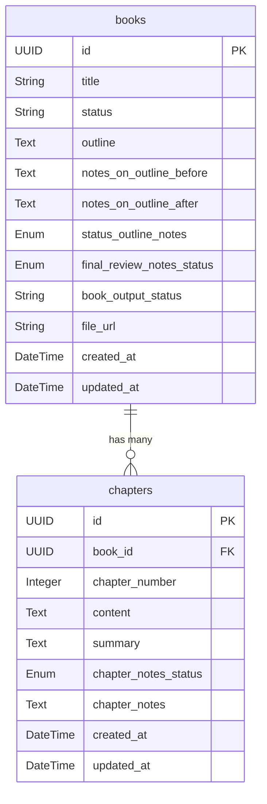

```mermaid
erDiagram
    books {
        UUID id PK
        String title
        String status
        Text outline
        Text notes_on_outline_before
        Text notes_on_outline_after
        Enum status_outline_notes
        Enum final_review_notes_status
        String book_output_status
        String file_url
        DateTime created_at
        DateTime updated_at
    }

    chapters {
        UUID id PK
        UUID book_id FK
        Integer chapter_number
        Text content
        Text summary
        Enum chapter_notes_status
        Text chapter_notes
        DateTime created_at
        DateTime updated_at
    }

    books ||--o{ chapters : "has many"
```
